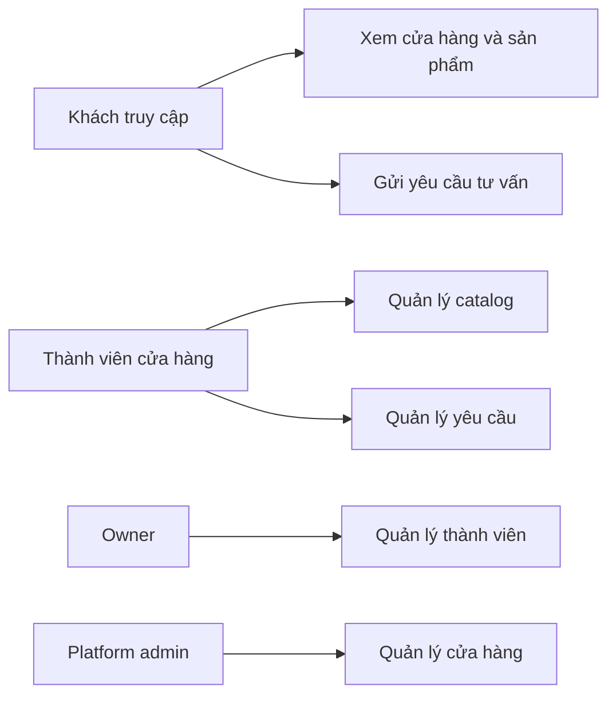
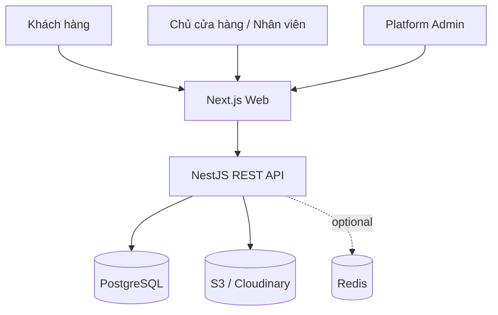
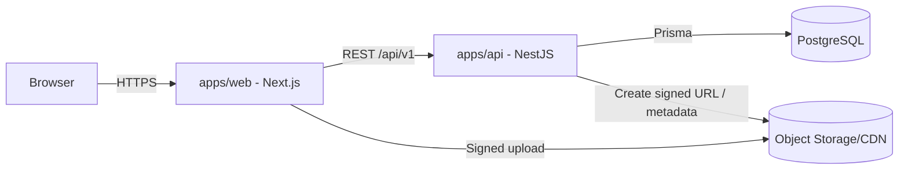
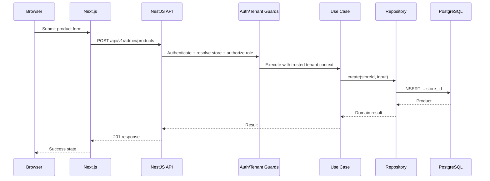
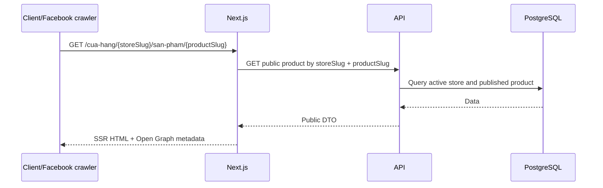
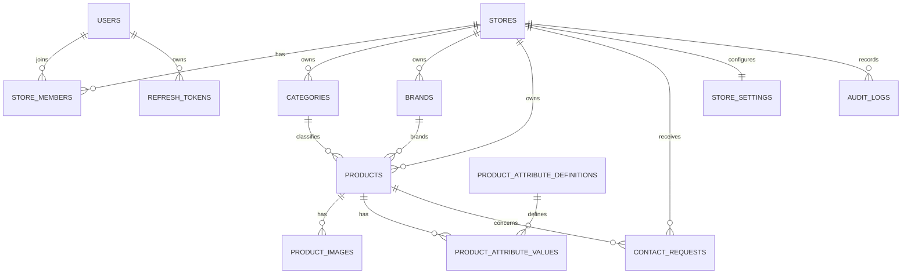
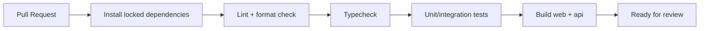

# HOMEHUB MASTER SPECIFICATION

> This file is the original documentation snapshot. The maintained source of
> truth now also includes `DESIGN.md`, `docs/15-REQUIREMENTS-GAP-ANALYSIS.md`
> and `docs/16-IMPLEMENTATION-PLAN.md`; read those files for the design system,
> newly identified requirements and the current implementation sequence.
> Generated from the project documentation pack. The individual files remain the source of truth for focused editing.

---

<!-- Source: README.md -->

# HomeHub Documentation Pack

Bộ tài liệu nguồn chuẩn cho dự án **HomeHub** – nền tảng đa cửa hàng dùng để giới thiệu sản phẩm/dịch vụ và tiếp nhận nhu cầu tư vấn.

## Mục tiêu

- Giúp con người và AI hiểu cùng một phạm vi, kiến trúc và quy tắc triển khai.
- Giảm việc AI tự suy diễn hoặc thay đổi công nghệ không cần thiết.
- Đảm bảo multi-tenant, bảo mật, kiểm thử và khả năng bảo trì được xem là yêu cầu bắt buộc.

## Phạm vi giai đoạn 1

HomeHub cho phép nhiều cửa hàng tạo website catalog riêng, quản lý sản phẩm/dịch vụ và nhận yêu cầu tư vấn. Giai đoạn 1 **không** triển khai giỏ hàng, thanh toán, giao vận hoặc quản lý kho chuyên sâu.

## Thứ tự đọc khuyến nghị

1. `docs/00-VISION-AND-SCOPE.md`
2. `docs/01-PRD.md`
3. `docs/02-USE-CASES.md`
4. `docs/03-SYSTEM-ARCHITECTURE.md`
5. `docs/04-DATABASE-DESIGN.md`
6. `docs/05-API-DESIGN.md`
7. `docs/06-SECURITY-AND-MULTITENANCY.md`
8. `docs/10-ROADMAP-AND-BACKLOG.md`
9. `docs/11-AI-HANDOFF.md`
10. `AGENTS.md`

## Cách đưa vào repository

Sao chép toàn bộ nội dung của thư mục này vào thư mục gốc repository HomeHub. AI coding agent phải đọc `AGENTS.md` và `docs/11-AI-HANDOFF.md` trước khi chỉnh sửa mã nguồn.

## Stack đã thống nhất

- TypeScript
- Next.js App Router
- NestJS modular monolith
- PostgreSQL
- Prisma ORM
- Tailwind CSS + shadcn/ui
- REST API + OpenAPI
- S3-compatible object storage hoặc Cloudinary
- pnpm workspace + Turborepo
- Docker + GitHub Actions

## Quy tắc tối quan trọng

1. Dữ liệu của cửa hàng phải được cô lập tuyệt đối bằng `store_id`.
2. Backend không tin `storeId` do client gửi lên.
3. Controller không chứa business logic và không gọi Prisma trực tiếp.
4. Mọi thay đổi schema phải có migration.
5. Mọi chức năng liên quan tenant phải có kiểm thử cross-tenant.
6. Không mở rộng sang thương mại điện tử trong MVP nếu chưa có quyết định mới.

---

<!-- Source: AGENTS.md -->

# AGENTS.md — HomeHub

Tài liệu này là chỉ dẫn bắt buộc cho mọi AI coding agent làm việc trong repository.

## 1. Nguồn sự thật

Đọc theo thứ tự:

1. `docs/00-VISION-AND-SCOPE.md`
2. `docs/01-PRD.md`
3. `docs/03-SYSTEM-ARCHITECTURE.md`
4. `docs/04-DATABASE-DESIGN.md`
5. `docs/05-API-DESIGN.md`
6. `docs/06-SECURITY-AND-MULTITENANCY.md`
7. `docs/11-AI-HANDOFF.md`
8. ADR trong `docs/adr/`

Khi tài liệu mâu thuẫn, ưu tiên theo thứ tự: ADR mới nhất → Security & Multitenancy → Architecture → PRD → Backlog.

## 2. Kiến trúc không được tự ý thay đổi

- Monorepo: pnpm workspace + Turborepo.
- `apps/web`: Next.js App Router.
- `apps/api`: NestJS modular monolith.
- Database: PostgreSQL qua Prisma.
- API: REST, prefix `/api/v1`, tài liệu OpenAPI.
- Multi-tenant: shared database/shared schema, tenant-owned rows có `store_id`.
- Ảnh lưu ở object storage, không lưu binary trong PostgreSQL và không lưu vĩnh viễn trong container.

Không đưa vào microservices, GraphQL, event sourcing, Kubernetes hoặc CQRS toàn hệ thống nếu chưa có ADR được chấp thuận.

## 3. Quy tắc multi-tenant bắt buộc

- Không nhận `storeId` trong DTO tạo/sửa dữ liệu tenant nếu có thể suy ra từ phiên đăng nhập hoặc route công khai.
- Mọi truy vấn tenant-owned phải chứa điều kiện `store_id`.
- Không truy vấn theo `id` đơn lẻ đối với dữ liệu tenant-owned.
- Repository nhận `tenantContext` hoặc `storeId` rõ ràng.
- Category/brand/product/image/contact phải được kiểm tra cùng tenant trước khi liên kết.
- Viết test chứng minh cửa hàng A không đọc/sửa/xóa dữ liệu cửa hàng B.

## 4. Quy tắc code

- TypeScript `strict: true`.
- Không dùng `any` trừ khi có chú thích lý do.
- Controller mỏng: validate → gọi use case/service → map response.
- Business logic ở application/domain service.
- Prisma chỉ được gọi từ lớp infrastructure/repository hoặc data service đã được kiểm soát.
- Không log access token, refresh token, mật khẩu, secret hoặc nội dung nhạy cảm đầy đủ.
- Tên file dùng kebab-case; class/type dùng PascalCase; biến/hàm dùng camelCase.
- Mọi endpoint mới phải có DTO validation, authorization, OpenAPI description và test phù hợp.

## 5. Quy trình thực hiện một task

1. Đọc acceptance criteria.
2. Xác định module sở hữu nghiệp vụ.
3. Nêu ngắn gọn kế hoạch và file dự kiến thay đổi.
4. Implement phần nhỏ nhất đáp ứng yêu cầu.
5. Thêm/cập nhật migration nếu schema thay đổi.
6. Viết hoặc cập nhật test.
7. Chạy lint, typecheck, unit/integration test liên quan.
8. Cập nhật tài liệu nếu API, schema hoặc quyết định kiến trúc thay đổi.
9. Tóm tắt thay đổi, rủi ro và phần chưa hoàn thành.

## 6. Không được tự ý làm

- Không thêm chức năng thanh toán, đơn hàng hoặc vận chuyển trong MVP.
- Không thay đổi naming/URL công khai mà không cập nhật tài liệu và redirect plan.
- Không xóa migration đã được dùng ở môi trường chia sẻ.
- Không thêm dependency chỉ để giải quyết việc có thể làm bằng thư viện hiện có.
- Không commit secret, `.env`, file build hoặc ảnh upload thực tế.
- Không giả định thành công khi test chưa chạy.

## 7. Definition of Done tối thiểu

Task chỉ hoàn thành khi:

- Đạt acceptance criteria.
- Không phá isolation giữa tenant.
- Có validation và error handling.
- Có test phù hợp.
- Lint/typecheck/build liên quan thành công.
- API/schema/documentation được cập nhật khi cần.

---

<!-- Source: docs/00-VISION-AND-SCOPE.md -->

# 00 — Vision and Scope

## 1. Tầm nhìn

HomeHub là nền tảng giúp cửa hàng nhỏ và vừa tạo một website catalog chuyên nghiệp để giới thiệu sản phẩm/dịch vụ, chia sẻ liên kết trên Facebook/Zalo và chuyển đổi người xem thành khách hàng tiềm năng qua gọi điện hoặc biểu mẫu tư vấn.

## 2. Vấn đề cần giải quyết

Nhiều cửa hàng hiện chỉ đăng sản phẩm trên mạng xã hội. Thông tin bị phân tán, khó tìm lại, khó phân loại, khó xây dựng thương hiệu và chủ cửa hàng không tự quản lý được một website riêng.

HomeHub giải quyết bằng một nền tảng dùng chung nhưng mỗi cửa hàng có:

- Trang giới thiệu riêng.
- Danh mục và sản phẩm riêng.
- Logo, banner, thông tin liên hệ và giao diện riêng.
- Trang quản trị riêng.
- Dữ liệu được cô lập khỏi cửa hàng khác.

## 3. Mục tiêu giai đoạn 1

- Nhiều cửa hàng sử dụng cùng hệ thống.
- Chủ cửa hàng tự quản lý catalog.
- Khách xem tốt trên điện thoại.
- Mỗi sản phẩm có URL riêng để chia sẻ.
- Hỗ trợ SEO/Open Graph cơ bản.
- Khách có thể gọi, mở Zalo/Facebook hoặc gửi yêu cầu tư vấn.
- Có platform admin quản lý cửa hàng và tài khoản.

## 4. Ngoài phạm vi giai đoạn 1

- Giỏ hàng.
- Đơn hàng.
- Thanh toán trực tuyến.
- Đồng bộ đơn vị vận chuyển.
- Quản lý kho chuyên sâu.
- Marketplace tổng hợp sản phẩm giữa các cửa hàng.
- Ứng dụng mobile native.
- Chat realtime.
- Gợi ý AI.

## 5. Nhóm người dùng

### Khách truy cập

Không cần đăng nhập. Xem cửa hàng, tìm sản phẩm, xem chi tiết và liên hệ.

### Thành viên cửa hàng

- `OWNER`: toàn quyền trong cửa hàng.
- `MANAGER`: quản lý nội dung và thành viên theo chính sách.
- `EDITOR`: quản lý catalog.
- `VIEWER`: chỉ xem dữ liệu quản trị.

### Platform admin

Quản lý cửa hàng, trạng thái hoạt động, chủ cửa hàng và thống kê hệ thống.

## 6. Chỉ số thành công ban đầu

- Chủ cửa hàng có thể hoàn tất cấu hình và đăng sản phẩm đầu tiên mà không cần hỗ trợ kỹ thuật.
- Trang sản phẩm tải nhanh trên kết nối di động phổ biến.
- Link chia sẻ hiển thị đúng tên, mô tả và ảnh đại diện.
- Không có truy cập chéo tenant trong kiểm thử bảo mật.
- Luồng tạo cửa hàng → xuất bản sản phẩm → khách gửi tư vấn hoạt động end-to-end.

## 7. Giả định

- Mỗi cửa hàng có ít nhất một `OWNER`.
- Một người dùng có thể thuộc nhiều cửa hàng.
- Giá sản phẩm có thể là giá cố định, “từ”, khoảng giá hoặc “liên hệ”.
- Sản phẩm có thể không quản lý số lượng tồn kho ở giai đoạn 1.
- Dữ liệu người liên hệ thuộc về đúng cửa hàng nhận yêu cầu.

---

<!-- Source: docs/01-PRD.md -->

# 01 — Product Requirements Document

## 1. Tóm tắt sản phẩm

HomeHub là SaaS multi-tenant cho website catalog đa cửa hàng. Mỗi cửa hàng quản lý thông tin thương hiệu, danh mục, sản phẩm, dịch vụ và khách hàng tiềm năng của riêng mình.

## 2. Yêu cầu chức năng

### FR-01 — Quản lý tài khoản và đăng nhập

- Người dùng đăng nhập bằng email và mật khẩu.
- Hệ thống hỗ trợ đăng xuất, refresh session và quên mật khẩu ở mốc sau nếu cần.
- Tài khoản bị khóa không được truy cập admin.
- Một người dùng có thể là thành viên của nhiều cửa hàng.

### FR-02 — Quản lý cửa hàng

- Platform admin tạo, khóa, mở và xem cửa hàng.
- Chủ cửa hàng cập nhật tên, slug, logo, banner, mô tả, địa chỉ, giờ mở cửa và thông tin liên hệ.
- Slug cửa hàng là duy nhất toàn hệ thống.
- Cửa hàng bị khóa không cho phép chỉnh sửa và trang công khai hiển thị trạng thái phù hợp.

### FR-03 — Quản lý thành viên cửa hàng

- Owner xem danh sách thành viên.
- Owner mời/thêm thành viên và gán vai trò theo phạm vi được cho phép.
- Không cho phép xóa owner cuối cùng của cửa hàng.

### FR-04 — Quản lý danh mục

- CRUD danh mục và danh mục con.
- Sắp xếp thứ tự hiển thị.
- Ẩn/hiện danh mục.
- Slug danh mục duy nhất trong một cửa hàng.
- Không liên kết sản phẩm với danh mục thuộc cửa hàng khác.

### FR-05 — Quản lý thương hiệu

- CRUD thương hiệu theo cửa hàng.
- Thương hiệu có tên, slug, logo và trạng thái.
- Cho phép sản phẩm không có thương hiệu.

### FR-06 — Quản lý sản phẩm

- CRUD sản phẩm.
- Trường chính: tên, slug, SKU, mô tả ngắn, mô tả chi tiết, danh mục, thương hiệu, loại giá, giá, giá khuyến mãi, trạng thái tồn kho, trạng thái xuất bản, nổi bật.
- Nhiều ảnh, kéo thả sắp xếp, chọn ảnh chính.
- Hỗ trợ thuộc tính linh hoạt.
- Soft delete sản phẩm.
- Không công khai sản phẩm `DRAFT`, `HIDDEN` hoặc đã xóa.

### FR-07 — Quản lý dịch vụ

- CRUD dịch vụ tương tự catalog đơn giản.
- Dịch vụ có tên, slug, mô tả, ảnh, mức giá tham khảo và trạng thái.

### FR-08 — Website công khai

- Trang chủ cửa hàng.
- Danh sách sản phẩm.
- Chi tiết sản phẩm.
- Danh mục sản phẩm.
- Trang giới thiệu, dịch vụ và liên hệ.
- Tìm kiếm theo tên/SKU và lọc theo danh mục.
- Giao diện mobile-first.

### FR-09 — Liên hệ và khách hàng tiềm năng

- Nút gọi điện, Zalo, Facebook/Messenger.
- Form yêu cầu tư vấn gồm họ tên, số điện thoại, nội dung và sản phẩm quan tâm.
- Chủ cửa hàng xem danh sách và cập nhật trạng thái: `NEW`, `CONTACTED`, `COMPLETED`, `CANCELLED`.
- Chống spam cơ bản bằng rate limit/honeypot hoặc CAPTCHA khi cần.

### FR-10 — SEO và chia sẻ

- Metadata theo cửa hàng và sản phẩm.
- Open Graph image/title/description.
- Canonical URL.
- Sitemap theo dữ liệu đã xuất bản.
- Structured data cơ bản cho LocalBusiness và Product/Service.

### FR-11 — Audit và thống kê cơ bản

- Ghi audit cho thao tác nhạy cảm: tạo/sửa/xóa sản phẩm, thay đổi thành viên, thay đổi trạng thái cửa hàng.
- Thống kê cơ bản: tổng sản phẩm, yêu cầu mới, sản phẩm xuất bản.
- View count nâng cao có thể triển khai sau.

## 3. Quy tắc nghiệp vụ

- `salePrice` không lớn hơn `price` khi cả hai có giá trị.
- `FIXED` yêu cầu `price`; `CONTACT` không bắt buộc giá.
- Slug sản phẩm duy nhất trong từng cửa hàng.
- SKU duy nhất trong từng cửa hàng khi SKU được nhập.
- Sản phẩm chỉ thuộc category/brand cùng cửa hàng.
- Cửa hàng bị khóa không thể xuất bản nội dung mới.
- Chỉ `OWNER` được quản lý quyền owner khác.
- Không xóa owner cuối cùng.

## 4. Yêu cầu phi chức năng tóm tắt

- Bảo mật: OWASP cơ bản, multi-tenant isolation, secrets management.
- Hiệu năng: pagination, index, CDN ảnh, cache hợp lý.
- Khả dụng: responsive, accessibility cơ bản, trạng thái loading/error/empty.
- Bảo trì: module rõ ràng, TypeScript strict, tests, OpenAPI, migration.
- Vận hành: logging có cấu trúc, backup database, CI/CD.

## 5. Tiêu chí nghiệm thu MVP

1. Platform admin tạo được cửa hàng và owner.
2. Owner đăng nhập, cấu hình cửa hàng, tạo category và sản phẩm có ảnh.
3. Sản phẩm xuất bản hiển thị tại URL công khai.
4. Link sản phẩm có metadata chia sẻ phù hợp.
5. Khách gửi được yêu cầu tư vấn.
6. Owner xem và đổi trạng thái yêu cầu.
7. Kiểm thử chứng minh tenant A không truy cập tenant B.
8. Hệ thống deploy được bằng tài liệu vận hành.

---

<!-- Source: docs/02-USE-CASES.md -->

# 02 — Use Cases

## UC-01 — Platform admin tạo cửa hàng

**Actor:** Platform admin  
**Tiền điều kiện:** Đã đăng nhập và có quyền hệ thống.  
**Luồng chính:**

1. Nhập tên cửa hàng, slug, thông tin owner.
2. Hệ thống validate slug và email.
3. Tạo store, user nếu cần và membership `OWNER` trong một transaction.
4. Ghi audit log.
5. Trả thông tin cửa hàng vừa tạo.

**Ngoại lệ:** slug trùng; email không hợp lệ; transaction thất bại.

## UC-02 — Chủ cửa hàng cấu hình trang giới thiệu

1. Owner mở Store Settings.
2. Cập nhật logo, banner, mô tả, địa chỉ, số điện thoại, Zalo/Facebook, giờ mở cửa.
3. Hệ thống kiểm tra dữ liệu và quyền.
4. Lưu cấu hình; trang công khai phản ánh thay đổi.

## UC-03 — Editor tạo sản phẩm

1. Editor mở form sản phẩm.
2. Chọn danh mục, nhập thông tin, loại giá và thuộc tính.
3. Upload ảnh lên object storage.
4. Lưu ở trạng thái `DRAFT` hoặc `PUBLISHED` nếu đủ quyền.
5. Hệ thống tạo slug, kiểm tra uniqueness và tenant ownership.
6. Ghi audit log.

## UC-04 — Khách xem sản phẩm từ Facebook

1. Khách bấm link `/cua-hang/{storeSlug}/san-pham/{productSlug}`.
2. Next.js render metadata và nội dung sản phẩm.
3. API chỉ trả dữ liệu cửa hàng/sản phẩm đang hoạt động và đã xuất bản.
4. Khách xem ảnh, mô tả, giá và nút liên hệ.

## UC-05 — Khách gửi yêu cầu tư vấn

1. Khách nhập họ tên, số điện thoại, nội dung.
2. Frontend validate cơ bản.
3. Backend validate, rate limit và xác định store theo route.
4. Tạo `contact_request` trạng thái `NEW`.
5. Trả thông báo thành công không tiết lộ chi tiết nội bộ.

## UC-06 — Owner xử lý yêu cầu

1. Owner mở danh sách yêu cầu của cửa hàng hiện tại.
2. Lọc theo trạng thái/thời gian.
3. Xem chi tiết và đổi trạng thái.
4. Hệ thống ghi actor và thời gian thay đổi.

## UC-07 — Chuyển cửa hàng quản trị

1. Người dùng thuộc nhiều store mở bộ chọn cửa hàng.
2. Chọn store mong muốn.
3. Backend xác minh membership đang hoạt động.
4. Mọi request sau sử dụng tenant context đã xác thực.

## UC-08 — Chặn truy cập chéo tenant

1. Thành viên store A gửi request tới ID sản phẩm của store B.
2. Repository truy vấn bằng `(id, store_id=A)`.
3. Không tìm thấy dữ liệu; API trả `404` hoặc lỗi quyền theo chính sách, không tiết lộ sự tồn tại của tài nguyên B.
4. Security event được log khi phù hợp.

## Sơ đồ use-case mức cao



---

<!-- Source: docs/03-SYSTEM-ARCHITECTURE.md -->

# 03 — System Architecture

## 1. Kiến trúc lựa chọn

- Monorepo.
- Frontend Next.js App Router.
- Backend NestJS modular monolith.
- PostgreSQL + Prisma.
- Object storage cho media.
- REST API có OpenAPI.
- Multi-tenant shared database/shared schema.

## 2. Sơ đồ ngữ cảnh



## 3. Sơ đồ container



## 4. Ranh giới module backend

```text
AuthModule
UsersModule
StoresModule
StoreMembersModule
CategoriesModule
BrandsModule
ProductsModule
ProductAttributesModule
MediaModule
ServicesModule
ContactRequestsModule
StoreSettingsModule
AuditLogsModule
PlatformAdminModule
HealthModule
```

Quy tắc:

- Module sở hữu dữ liệu và nghiệp vụ của nó.
- Giao tiếp qua application service/public contract.
- Tránh circular dependency.
- Không dùng một `CommonService` chứa mọi nghiệp vụ.

## 5. Luồng request quản trị



## 6. Luồng trang công khai



## 7. Cấu trúc monorepo mục tiêu

```text
homehub/
├── apps/
│   ├── web/
│   └── api/
├── packages/
│   ├── api-client/
│   ├── ui/
│   ├── eslint-config/
│   └── typescript-config/
├── docs/
├── infrastructure/
├── .github/workflows/
├── AGENTS.md
├── pnpm-workspace.yaml
└── turbo.json
```

Không tách `shared-types` thành nơi chia sẻ Prisma model trực tiếp. Public API contract nên được sinh/đồng bộ từ OpenAPI để tránh frontend phụ thuộc cấu trúc database.

## 8. Cấu trúc module backend thực dụng

```text
modules/products/
├── presentation/
│   ├── controllers/
│   └── dto/
├── application/
│   ├── use-cases/
│   └── ports/
├── domain/
│   ├── entities/
│   ├── enums/
│   └── errors/
├── infrastructure/
│   ├── repositories/
│   └── mappers/
└── products.module.ts
```

Module đơn giản có thể gộp bớt tầng, nhưng controller không được chứa business logic.

## 9. Frontend structure

```text
apps/web/src/
├── app/
│   ├── (storefront)/cua-hang/[storeSlug]/...
│   ├── (dashboard)/admin/...
│   ├── (platform)/platform/...
│   └── login/
├── features/
│   ├── auth/
│   ├── stores/
│   ├── products/
│   ├── categories/
│   └── contact-requests/
├── components/
├── lib/
└── config/
```

## 10. Nguyên tắc mở rộng

- Scale web/API theo chiều ngang khi cần.
- Ảnh qua CDN/object storage.
- Redis chỉ thêm khi có yêu cầu cache/rate limit/queue thực tế.
- BullMQ có thể thêm cho xử lý ảnh, email, import dữ liệu.
- Search engine chỉ thêm khi PostgreSQL search không đáp ứng.
- Microservice chỉ xem xét khi có ranh giới vận hành rõ, tải độc lập và đội ngũ đủ năng lực.

---

<!-- Source: docs/04-DATABASE-DESIGN.md -->

# 04 — Database Design

## 1. Chiến lược multi-tenant

Sử dụng **shared database, shared schema**. Mọi bảng thuộc về cửa hàng phải có `store_id` và index phù hợp.

## 2. ERD mức cao



## 3. Bảng chính

### `users`

- `id` UUID/ULID, primary key.
- `email` unique, normalized.
- `password_hash`.
- `display_name`.
- `status`: ACTIVE, INVITED, LOCKED, DISABLED.
- timestamps.

### `stores`

- `id`.
- `name`.
- `slug` unique toàn hệ thống.
- `status`: ACTIVE, SUSPENDED, ARCHIVED.
- `owner_contact_email` tùy chọn.
- timestamps, `deleted_at` nếu cần archival.

### `store_members`

- `id`, `store_id`, `user_id`.
- `role`: OWNER, MANAGER, EDITOR, VIEWER.
- `status`: ACTIVE, INVITED, DISABLED.
- unique `(store_id, user_id)`.
- index `(user_id, status)` và `(store_id, role)`.

### `categories`

- `id`, `store_id`, `parent_id` nullable.
- `name`, `slug`, `description`, `image_key`.
- `sort_order`, `status`.
- unique `(store_id, slug)`.
- parent phải cùng `store_id`.

### `brands`

- `id`, `store_id`, `name`, `slug`, `logo_key`, `status`.
- unique `(store_id, slug)`.

### `products`

- `id`, `store_id`, `category_id`, `brand_id` nullable.
- `name`, `slug`, `sku` nullable.
- `short_description`, `description`.
- `price_type`: FIXED, CONTACT, FROM, RANGE.
- `price`, `sale_price`, `min_price`, `max_price` nullable.
- `stock_status`: IN_STOCK, OUT_OF_STOCK, PREORDER, UNKNOWN.
- `publication_status`: DRAFT, PUBLISHED, HIDDEN.
- `is_featured`, `published_at`.
- timestamps, `deleted_at`.
- unique `(store_id, slug)`.
- unique `(store_id, sku)` khi SKU không null.

### `product_images`

- `id`, `store_id`, `product_id`.
- `storage_key`, `public_url` hoặc URL được suy ra.
- `alt_text`, `sort_order`, `is_primary`, `width`, `height`, `mime_type`.
- index `(store_id, product_id, sort_order)`.

### `product_attribute_definitions`

- `id`, `store_id`, `category_id` nullable.
- `name`, `code`, `data_type`: TEXT, NUMBER, BOOLEAN, SELECT.
- `is_filterable`, `sort_order`, `options_json` nullable.
- unique `(store_id, code)`.

### `product_attribute_values`

- `id`, `store_id`, `product_id`, `attribute_definition_id`.
- một trong `value_text`, `value_number`, `value_boolean`, `value_json`.
- unique `(product_id, attribute_definition_id)`.
- definition và product phải cùng store.

### `contact_requests`

- `id`, `store_id`, `product_id` nullable.
- `customer_name`, `customer_phone`, `customer_email` nullable.
- `message`.
- `status`: NEW, CONTACTED, COMPLETED, CANCELLED.
- `source`: WEBSITE, FACEBOOK, ZALO, OTHER.
- `assigned_to_user_id` nullable.
- timestamps.

### `store_settings`

- `store_id` unique.
- logo/banner storage keys.
- description, address, phone, email.
- zalo_url, facebook_url, map_url.
- opening_hours JSONB.
- theme settings JSONB có schema validation ở application layer.
- SEO defaults.

### `refresh_tokens`

- `id`, `user_id`, `token_hash`, `expires_at`, `revoked_at`, device metadata.
- Không lưu token thô.

### `audit_logs`

- `id`, `store_id` nullable cho platform event.
- `actor_user_id`.
- `action`, `entity_type`, `entity_id`.
- `before_json`, `after_json` đã lọc dữ liệu nhạy cảm.
- IP/user-agent tùy chính sách.
- `created_at`.

## 4. Index bắt buộc

```text
products(store_id, publication_status, deleted_at)
products(store_id, category_id, publication_status)
products(store_id, slug)
categories(store_id, slug)
brands(store_id, slug)
contact_requests(store_id, status, created_at DESC)
store_members(user_id, status)
product_images(store_id, product_id, sort_order)
```

## 5. Quy tắc truy vấn

Không dùng:

```ts
prisma.product.findUnique({ where: { id } });
```

Đối với tenant-owned resource, dùng điều kiện tenant:

```ts
prisma.product.findFirst({
  where: { id, storeId, deletedAt: null },
});
```

Hoặc thiết kế compound key phù hợp.

## 6. Transaction

Dùng transaction cho:

- Tạo store + owner membership.
- Tạo product + attributes + image metadata nếu cần atomicity.
- Chuyển owner/xóa membership nhạy cảm.
- Xóa mềm sản phẩm và cập nhật liên quan.

## 7. Migration và seed

- Mỗi thay đổi schema có migration riêng, tên mô tả rõ.
- Không chỉnh sửa migration đã được áp dụng ở môi trường chia sẻ.
- Seed chỉ tạo dữ liệu demo không chứa secret.
- Có ít nhất hai store demo để chạy test cross-tenant.

---

<!-- Source: docs/05-API-DESIGN.md -->

# 05 — API Design

## 1. Nguyên tắc

- REST JSON.
- Prefix `/api/v1`.
- OpenAPI là contract có thể sinh API client.
- JSON dùng camelCase.
- ID là opaque string; client không suy luận cấu trúc.
- Pagination mặc định; giới hạn `pageSize` phía server.
- Lỗi có `code` ổn định để frontend xử lý.

## 2. Nhóm endpoint

### Authentication

```text
POST /api/v1/auth/login
POST /api/v1/auth/refresh
POST /api/v1/auth/logout
GET  /api/v1/auth/me
```

### Public storefront

```text
GET  /api/v1/public/stores/{storeSlug}
GET  /api/v1/public/stores/{storeSlug}/categories
GET  /api/v1/public/stores/{storeSlug}/products
GET  /api/v1/public/stores/{storeSlug}/products/{productSlug}
GET  /api/v1/public/stores/{storeSlug}/services
POST /api/v1/public/stores/{storeSlug}/contact-requests
```

### Store admin

```text
GET    /api/v1/admin/context
GET    /api/v1/admin/products
POST   /api/v1/admin/products
GET    /api/v1/admin/products/{productId}
PATCH  /api/v1/admin/products/{productId}
DELETE /api/v1/admin/products/{productId}

GET    /api/v1/admin/categories
POST   /api/v1/admin/categories
PATCH  /api/v1/admin/categories/{categoryId}
DELETE /api/v1/admin/categories/{categoryId}

GET    /api/v1/admin/contact-requests
GET    /api/v1/admin/contact-requests/{contactRequestId}
PATCH  /api/v1/admin/contact-requests/{contactRequestId}/status

GET    /api/v1/admin/store-settings
PATCH  /api/v1/admin/store-settings
POST   /api/v1/admin/media/upload-url
```

Tenant được xác định từ authenticated context. Không đặt `storeId` trong body để client tự chọn.

### Platform admin

```text
GET   /api/v1/platform/stores
POST  /api/v1/platform/stores
GET   /api/v1/platform/stores/{storeId}
PATCH /api/v1/platform/stores/{storeId}/status
POST  /api/v1/platform/stores/{storeId}/owners
```

## 3. Response chuẩn

### Thành công đơn

```json
{
  "data": {
    "id": "prd_123",
    "name": "Bàn ăn gỗ sồi"
  }
}
```

### Danh sách

```json
{
  "data": [],
  "meta": {
    "page": 1,
    "pageSize": 20,
    "total": 0,
    "totalPages": 0
  }
}
```

### Lỗi

```json
{
  "error": {
    "code": "PRODUCT_NOT_FOUND",
    "message": "Không tìm thấy sản phẩm",
    "details": null,
    "requestId": "req_..."
  }
}
```

## 4. HTTP status

- `200`: đọc/cập nhật thành công.
- `201`: tạo thành công.
- `204`: xóa/không có body.
- `400`: dữ liệu không hợp lệ.
- `401`: chưa xác thực/session hết hạn.
- `403`: không đủ quyền.
- `404`: tài nguyên không tồn tại hoặc không thuộc tenant hiện tại.
- `409`: conflict/slug trùng/quy tắc nghiệp vụ.
- `422`: validation phức tạp nếu dự án lựa chọn dùng.
- `429`: rate limit.
- `500`: lỗi nội bộ không lộ chi tiết.

## 5. Query danh sách sản phẩm

```text
GET /api/v1/public/stores/{storeSlug}/products
  ?page=1
  &pageSize=24
  &search=ban+an
  &categorySlug=ban-ghe
  &brandSlug=...
  &featured=true
  &sort=newest
```

Chỉ whitelist giá trị sort. Không nối trực tiếp query client vào SQL.

## 6. Idempotency và concurrency

- PATCH dùng cập nhật một phần.
- Có thể bổ sung `version`/optimistic concurrency cho form quan trọng sau MVP.
- Upload URL có thời hạn ngắn và giới hạn loại file/kích thước.

## 7. Public DTO

Public API không trả:

- `storeId` nội bộ nếu không cần.
- audit fields nhạy cảm.
- email quản trị.
- storage secret/key không an toàn.
- sản phẩm draft/hidden/deleted.

---

<!-- Source: docs/06-SECURITY-AND-MULTITENANCY.md -->

# 06 — Security and Multitenancy

## 1. Mục tiêu bảo mật

- Ngăn truy cập chéo tenant.
- Bảo vệ tài khoản quản trị.
- Không lộ secret/token/PII.
- Upload media an toàn.
- Giảm spam và abuse trên public form.
- Có audit trail cho thao tác quan trọng.

## 2. Tenant context

### Admin request

Tenant context được suy ra từ:

1. Authenticated user.
2. Store membership đang hoạt động.
3. Store đang hoạt động.
4. Store được chọn trong session/header đã được backend xác thực.

Client có thể gửi ID cửa hàng đang chọn, nhưng backend phải xác minh membership trước khi tạo trusted context.

### Public request

Tenant được suy ra từ `storeSlug`; backend chỉ trả store `ACTIVE` và dữ liệu `PUBLISHED`.

## 3. Chống IDOR

Mọi thao tác tenant-owned dùng điều kiện kép:

```text
resource.id = requestedId
AND resource.store_id = trustedStoreId
```

Không kiểm tra ownership sau khi đã tải resource bằng ID đơn lẻ.

## 4. Authentication

- Password hash bằng Argon2 hoặc bcrypt với cấu hình an toàn.
- Access token ngắn hạn.
- Refresh token trong HttpOnly, Secure cookie hoặc cơ chế session tương đương.
- Refresh token lưu dạng hash, hỗ trợ revoke.
- SameSite và CORS được cấu hình theo topology triển khai.
- Rate limit login và refresh.
- Không lưu refresh token trong localStorage.

## 5. Authorization

RBAC cấp cửa hàng:

| Quyền | OWNER | MANAGER | EDITOR | VIEWER |
|---|---:|---:|---:|---:|
| Xem dashboard | ✓ | ✓ | ✓ | ✓ |
| CRUD sản phẩm | ✓ | ✓ | ✓ | chỉ xem |
| Quản lý yêu cầu | ✓ | ✓ | tùy chính sách | chỉ xem |
| Cấu hình cửa hàng | ✓ | ✓ | ✗ | ✗ |
| Quản lý thành viên | ✓ | tùy chính sách | ✗ | ✗ |
| Gán OWNER | ✓ | ✗ | ✗ | ✗ |

Platform admin là scope riêng, không dùng chung role store.

## 6. Validation và output encoding

- Validate DTO bằng whitelist và reject field lạ ở API nhạy cảm.
- Giới hạn độ dài tên, slug, mô tả và message.
- Sanitize/kiểm soát rich text trước khi render.
- Không render HTML người dùng nhập bằng `dangerouslySetInnerHTML` nếu chưa sanitize.
- Dùng parameterized query qua Prisma.

## 7. Upload media

- Whitelist MIME: JPEG, PNG, WebP; SVG chỉ khi có quy trình sanitize rõ.
- Giới hạn kích thước và số lượng ảnh.
- Tên object sinh bởi server, không dùng tên file client làm path tin cậy.
- Signed URL có thời hạn ngắn.
- Xác minh metadata sau upload nếu cần.
- Không cho upload executable/public HTML.

## 8. Public contact form

- Rate limit theo IP/store.
- Honeypot hoặc CAPTCHA khi có dấu hiệu spam.
- Validate số điện thoại và độ dài message.
- Không phản hồi thông tin cho biết số điện thoại/email đã tồn tại.
- Log tối thiểu; có chính sách lưu trữ/xóa PII.

## 9. Secrets và logging

- Secret chỉ ở environment/secret manager.
- Không commit `.env`.
- Redact authorization header, cookie, password, token.
- Log có `requestId`, actorId, storeId và outcome; không log PII đầy đủ nếu không cần.

## 10. Database security

- App user không dùng superuser.
- Migrations dùng credential riêng khi có thể.
- Backup mã hóa và kiểm thử restore.
- Có thể bổ sung PostgreSQL Row Level Security ở giai đoạn hardening, nhưng không thay thế application-level scoping.

## 11. Security test bắt buộc

- Store A không GET/PATCH/DELETE product của Store B.
- Store A không gắn category/brand/image của Store B.
- Viewer không tạo/sửa dữ liệu.
- Editor không quản lý owner.
- Public API không trả draft/hidden/deleted.
- Suspended store không cho thao tác quản trị bị cấm.
- Upload URL không tạo được nếu thiếu quyền.
- Login rate limit hoạt động.

---

<!-- Source: docs/07-UI-UX-GUIDELINES.md -->

# 07 — UI/UX Guidelines

## 1. Nguyên tắc

- Mobile-first vì khách chủ yếu mở từ Facebook/Zalo.
- Tập trung vào xem nhanh và liên hệ nhanh.
- Giao diện admin đơn giản, tránh thuật ngữ kỹ thuật.
- Mọi màn hình có trạng thái loading, empty, error và success.

## 2. Storefront

### Trang chủ cửa hàng

- Logo, banner, tên, mô tả ngắn.
- Nút gọi/Zalo dễ chạm.
- Danh mục nổi bật.
- Sản phẩm nổi bật/mới.
- Địa chỉ, giờ mở cửa, bản đồ.

### Danh sách sản phẩm

- Card có ảnh, tên, giá hoặc “Liên hệ”, nhãn nổi bật.
- Tìm kiếm và lọc danh mục.
- Pagination hoặc load more có kiểm soát.
- Không tải toàn bộ dữ liệu cùng lúc.

### Chi tiết sản phẩm

- Gallery ảnh.
- Tên, giá, trạng thái, mô tả, thông số.
- CTA cố định hợp lý trên mobile: Gọi ngay / Zalo / Yêu cầu tư vấn.
- Sản phẩm liên quan cùng tenant.

## 3. Admin

- Sidebar ngắn: Tổng quan, Sản phẩm, Danh mục, Liên hệ, Cửa hàng, Thành viên.
- Form chia section, không dồn toàn bộ vào một khối dài.
- Autosave không bắt buộc; hiển thị rõ trạng thái đã lưu/chưa lưu.
- Cảnh báo trước thao tác xóa/ẩn.
- Bảng hỗ trợ tìm kiếm, lọc, pagination.

## 4. Accessibility

- Keyboard navigation cơ bản.
- Focus state rõ.
- Label thật cho input.
- Alt text cho ảnh.
- Contrast đủ đọc.
- Không dùng màu làm tín hiệu duy nhất.
- Dialog có focus trap và đóng bằng Escape.

## 5. SEO và social preview

- Mỗi store/product có title/description riêng.
- Open Graph image tối thiểu rõ ràng, không méo.
- URL canonical:
  - `/cua-hang/{storeSlug}`
  - `/cua-hang/{storeSlug}/san-pham/{productSlug}`
- Metadata chỉ lấy từ nội dung đã xuất bản.

## 6. Design system

- Tailwind CSS + shadcn/ui.
- Token hóa spacing, radius, typography và semantic colors.
- Theme cửa hàng chỉ cho phép cấu hình giới hạn: màu chính, logo, banner; không cho CSS tùy ý trong MVP.
- Component form, button, badge, empty state, data table dùng chung.

---

<!-- Source: docs/08-TESTING-STRATEGY.md -->

# 08 — Testing Strategy

## 1. Mục tiêu

Kiểm thử tập trung vào rủi ro nghiệp vụ và multi-tenant, không chạy theo độ phủ dòng code hình thức.

## 2. Pyramid

### Unit test

- Use case và business rules.
- Price validation.
- Permission decision.
- Slug generation.
- Mapping domain/API.

### Integration test

- Prisma repository với PostgreSQL test.
- Unique constraints.
- Transaction.
- Soft delete.
- Tenant scoping.

### E2E/API test

- Login/logout/refresh.
- Tạo category/product.
- Publish và public read.
- Contact request.
- Cross-tenant denial.

### Browser E2E

Dùng Playwright cho các luồng quan trọng:

1. Owner đăng nhập.
2. Tạo category.
3. Tạo sản phẩm có ảnh.
4. Publish.
5. Mở storefront.
6. Gửi yêu cầu tư vấn.
7. Owner cập nhật trạng thái yêu cầu.

## 3. Test fixtures

Tối thiểu:

- Store A và Store B.
- Owner A, Editor A, Viewer A, Owner B, Platform admin.
- Category/product ở mỗi store.
- Store suspended để kiểm thử trạng thái.

## 4. Ma trận permission

Mỗi endpoint quản trị phải được test với:

- unauthenticated.
- user không thuộc store.
- viewer.
- editor.
- manager.
- owner.
- platform admin nếu endpoint liên quan.

## 5. Test dữ liệu công khai

- Chỉ published product được trả.
- Hidden/draft/deleted không xuất hiện.
- Store suspended xử lý đúng.
- Product slug cùng tên ở hai store không xung đột.

## 6. CI gates

Pull request phải chạy:

```text
lint
format-check
typecheck
unit tests
integration tests trọng yếu
build
```

E2E đầy đủ có thể chạy trên main hoặc trước release tùy thời gian.

## 7. Tiêu chí lỗi

Bug thuộc các nhóm sau là release blocker:

- Truy cập chéo tenant.
- Bypass role.
- Mất dữ liệu.
- Lộ token/secret/PII.
- Không thể đăng nhập hoặc xuất bản sản phẩm.
- Public product không thể truy cập từ URL chuẩn.

---

<!-- Source: docs/09-DEVOPS-AND-OPERATIONS.md -->

# 09 — DevOps and Operations

## 1. Môi trường

- `local`: phát triển cá nhân.
- `test`: integration/E2E.
- `staging`: gần production, dùng demo/nghiệm thu.
- `production`: dữ liệu thật.

Không dùng chung database giữa staging và production.

## 2. Environment variables

Ví dụ nhóm biến:

```text
DATABASE_URL
APP_BASE_URL
WEB_BASE_URL
ACCESS_TOKEN_SECRET
REFRESH_TOKEN_SECRET
OBJECT_STORAGE_ENDPOINT
OBJECT_STORAGE_BUCKET
OBJECT_STORAGE_ACCESS_KEY
OBJECT_STORAGE_SECRET_KEY
CORS_ALLOWED_ORIGINS
LOG_LEVEL
```

Validate environment khi ứng dụng khởi động.

## 3. Docker local

Docker Compose nên cung cấp:

- PostgreSQL.
- MinIO tùy chọn cho object storage local.
- Redis chỉ khi module thực sự sử dụng.

Web/API có thể chạy local ngoài container để hot reload nhanh.

## 4. CI pipeline



## 5. CD

- Deploy staging sau merge main.
- Production cần manual approval trong giai đoạn đầu.
- Chạy migration theo chiến lược backward-compatible.
- Có health check trước khi chuyển traffic.

## 6. Observability

Tối thiểu:

- Structured JSON logs ở API.
- `requestId` xuyên request.
- Health endpoints: liveness và readiness.
- Theo dõi HTTP error rate, latency, database connection và storage error.
- Error tracking cho web/API nếu có ngân sách.

## 7. Backup và restore

- Backup PostgreSQL định kỳ.
- Object storage bật versioning/lifecycle nếu dịch vụ hỗ trợ.
- Có tài liệu restore và kiểm thử restore định kỳ.
- Không coi backup là hợp lệ nếu chưa thử phục hồi.

## 8. Migration production

- Không chạy destructive migration trực tiếp nếu chưa có plan.
- Thêm cột nullable/default trước, backfill, sau đó mới enforce constraint.
- Backup trước migration rủi ro.
- Ghi migration version trong release notes.

## 9. Release checklist

- CI xanh.
- Migration đã review.
- Không có secret trong diff.
- Cross-tenant tests xanh.
- OpenAPI và docs cập nhật.
- Smoke test: login, create/view product, contact form.
- Rollback plan rõ ràng.

---

<!-- Source: docs/10-ROADMAP-AND-BACKLOG.md -->

# 10 — Roadmap and Backlog

## Milestone 0 — Foundation

- Khởi tạo monorepo pnpm/Turborepo.
- Next.js + NestJS + Prisma + PostgreSQL.
- Lint, format, TypeScript strict.
- Docker Compose local.
- CI cơ bản.
- OpenAPI setup.
- Health check.

**Exit criteria:** web/API build được; API kết nối database; CI xanh.

## Milestone 1 — Identity và Multi-tenancy

- User, store, store_members schema.
- Login/refresh/logout/me.
- Platform admin tạo store + owner.
- Store selector/context.
- Auth, tenant và role guards.
- Cross-tenant integration tests.

**Exit criteria:** owner A không thể đọc bất kỳ resource tenant B trong test mẫu.

## Milestone 2 — Catalog Admin

- Categories.
- Brands.
- Products.
- Product images.
- Flexible attributes bản MVP.
- Draft/publish/hide.
- Audit log cho catalog.

**Exit criteria:** owner tạo và publish sản phẩm có ảnh từ admin.

## Milestone 3 — Public Storefront

- Store home.
- Product listing/detail.
- Category page.
- Search cơ bản.
- Responsive/mobile-first.
- SEO/Open Graph.

**Exit criteria:** link sản phẩm public render server-side với metadata đúng.

## Milestone 4 — Leads và Store Settings

- Store profile/settings.
- Contact form.
- Lead management/status.
- Rate limit/spam protection.
- Dashboard summary.

**Exit criteria:** khách gửi lead, owner xem và xử lý trong đúng tenant.

## Milestone 5 — Hardening và Release

- E2E browser tests.
- Performance pass.
- Accessibility pass.
- Backup/restore guide.
- Deployment staging/production.
- Demo data và tài liệu nghiệm thu.

## Backlog ưu tiên

### P0 — Bắt buộc MVP

- HH-001 Bootstrap monorepo.
- HH-002 Database foundation và migrations.
- HH-003 Authentication.
- HH-004 Tenant context và authorization.
- HH-005 Platform store management.
- HH-006 Store settings.
- HH-007 Category CRUD.
- HH-008 Product CRUD.
- HH-009 Media upload.
- HH-010 Storefront public.
- HH-011 Contact requests.
- HH-012 Cross-tenant security tests.
- HH-013 Deployment and backup.

### P1 — Nên có

- Brand CRUD.
- Product attributes definition/value.
- Member management.
- Audit log UI.
- Sitemap và structured data.
- Import CSV/Excel có giới hạn.
- Dashboard summary.

### P2 — Sau MVP

- Custom domain.
- Theme nâng cao.
- Redis cache.
- Background jobs.
- Advanced analytics.
- Notification email/Zalo provider.
- Full-text/faceted search nâng cao.

## Mẫu user story

**HH-008 — Tạo sản phẩm**  
Là Editor, tôi muốn tạo sản phẩm trong cửa hàng hiện tại để khách có thể xem sau khi sản phẩm được xuất bản.

**Acceptance criteria:**

- Không có `storeId` trong body public DTO.
- Category/brand phải thuộc tenant hiện tại.
- Slug unique trong store.
- Giá tuân thủ `priceType`.
- Có thể lưu draft.
- Có audit log.
- Có unit/integration test và cross-tenant test.

---

<!-- Source: docs/11-AI-HANDOFF.md -->

# 11 — AI Handoff Guide

## 1. Mục đích

Tài liệu này giúp giao dự án cho AI coding agent mà không để agent tự thay đổi phạm vi, kiến trúc hoặc bỏ qua multi-tenant/security.

## 2. Prompt khởi đầu đề xuất

```text
Bạn đang phát triển dự án HomeHub. Trước khi viết code, hãy đọc AGENTS.md và toàn bộ tài liệu được liên kết trong đó. Không tự ý thay đổi stack hoặc kiến trúc. Hãy bắt đầu bằng task [TASK_ID] trong docs/10-ROADMAP-AND-BACKLOG.md.

Trước khi chỉnh sửa:
1. Tóm tắt acceptance criteria.
2. Nêu module/file dự kiến thay đổi.
3. Nêu rủi ro multi-tenant và security.

Sau khi chỉnh sửa:
1. Liệt kê file đã thay đổi.
2. Nêu migration/API contract thay đổi.
3. Báo kết quả lint/typecheck/test thực tế.
4. Nêu phần chưa hoàn thành hoặc giả định.
```

## 3. Thứ tự handoff

Không giao AI “xây toàn bộ hệ thống” trong một prompt. Giao theo milestone và task nhỏ:

1. Foundation.
2. Database schema.
3. Auth.
4. Tenant context.
5. Một module CRUD hoàn chỉnh.
6. Storefront.
7. Leads.
8. Hardening.

Mỗi task nên có acceptance criteria và giới hạn file/module.

## 4. Yêu cầu AI phải xác nhận trước code

- Task đang làm thuộc milestone nào.
- Đã đọc ADR liên quan chưa.
- Tenant context lấy từ đâu.
- Endpoint nào public/admin/platform.
- Test nào chứng minh không truy cập chéo tenant.

## 5. Output mong đợi từ AI

- Code nhỏ, có thể review.
- Không thay đổi ngoài task.
- Migration rõ tên.
- DTO validation.
- OpenAPI decorator/schema.
- Unit/integration test.
- Cập nhật docs khi contract thay đổi.
- Không giả báo test thành công.

## 6. Checklist review mã AI sinh ra

- Có controller gọi Prisma trực tiếp không?
- Có dùng `findUnique({id})` cho tenant resource không?
- Có tin `storeId` từ request body không?
- Có thiếu role guard không?
- Có trả draft/hidden ra public API không?
- Có log token/PII không?
- Có migration và rollback consideration không?
- Có test cho store A/store B không?
- Có thêm dependency không cần thiết không?
- Có phá API/naming mà không cập nhật docs không?

## 7. First implementation package nên giao AI

### Task A — Bootstrap

- Tạo monorepo `apps/web`, `apps/api`.
- Cấu hình pnpm/Turborepo.
- TypeScript strict, ESLint, Prettier.
- Docker Compose PostgreSQL.
- Nest health endpoint.
- Next placeholder page.
- CI lint/typecheck/build.

### Task B — Prisma foundation

- User, Store, StoreMember schema.
- Enum status/role.
- Migration + seed hai store demo.
- Prisma service/module.
- Integration test kết nối database.

### Task C — Auth and tenant context

- Login/refresh/logout/me.
- Guard xác thực.
- Store membership resolver.
- Current store context.
- Cross-tenant test skeleton.

Chỉ sau khi A–C ổn định mới bắt đầu catalog CRUD.

## 8. Quy tắc quyết định khi tài liệu chưa đủ

AI không tự phát minh nghiệp vụ ảnh hưởng schema/API. Ghi câu hỏi vào `docs/OPEN-QUESTIONS.md` hoặc hỏi người phụ trách. Với chi tiết nhỏ, AI được chọn phương án đơn giản nhất nhưng phải ghi giả định trong summary.

---

<!-- Source: docs/12-DEFINITION-OF-DONE.md -->

# 12 — Definition of Done

Một user story/task được coi là hoàn thành khi thỏa tất cả mục liên quan.

## Chức năng

- Đạt acceptance criteria.
- Xử lý happy path, empty state và lỗi chính.
- Không thực hiện tính năng ngoài phạm vi.

## Kiến trúc

- Nằm đúng module.
- Controller mỏng.
- Không tạo circular dependency.
- Không gọi Prisma tùy tiện ngoài data layer được chấp thuận.

## Multi-tenant và security

- Tenant context là trusted server context.
- Mọi tenant query scoped bằng `store_id`.
- Role guard đúng.
- Input validated.
- Output không lộ dữ liệu nội bộ.
- Cross-tenant test có hoặc được cập nhật.

## Database

- Có migration nếu schema thay đổi.
- Constraint/index phù hợp.
- Có transaction khi cần.
- Không sửa migration lịch sử đã dùng.

## API

- Endpoint/DTO/error code nhất quán.
- OpenAPI cập nhật.
- Không breaking change không được ghi nhận.

## Frontend

- Loading/empty/error/success state.
- Responsive.
- Form có label và validation.
- Không lộ lỗi kỹ thuật thô cho người dùng.

## Quality

- Lint và typecheck thành công.
- Test liên quan thành công.
- Build phần bị ảnh hưởng thành công.
- Không có secret hoặc debug code.

## Documentation

- README/architecture/API/schema/ADR được cập nhật nếu thay đổi quyết định hoặc contract.
- Summary nêu rõ test đã chạy và phần chưa hoàn thành.

---

<!-- Source: docs/13-NON-FUNCTIONAL-REQUIREMENTS.md -->

# 13 — Non-Functional Requirements

## Performance

- Public pages sử dụng SSR/ISR phù hợp và CDN cho ảnh.
- API danh sách luôn pagination.
- Mục tiêu ban đầu: p95 API đọc phổ biến dưới 500 ms trong môi trường staging với dữ liệu demo hợp lý, không tính độ trễ dịch vụ bên ngoài.
- Ảnh có responsive sizes, lazy loading và định dạng tối ưu.

## Availability và resilience

- Health/readiness checks.
- Timeout cho external storage/provider.
- Lỗi provider không làm lộ stack trace.
- Backup database và restore procedure.

## Scalability

- Web/API stateless trong khả năng có thể.
- Session/token không phụ thuộc memory của một instance.
- Object storage tách khỏi container.
- Index theo store và trạng thái.

## Maintainability

- TypeScript strict.
- Modular monolith với ownership rõ.
- OpenAPI contract.
- Migration versioned.
- ADR cho quyết định lớn.
- CI quality gates.

## Accessibility

- Các luồng chính sử dụng được bằng bàn phím.
- Input có label.
- Focus rõ.
- Alt text.
- Contrast đủ.

## Privacy

- Thu thập tối thiểu dữ liệu liên hệ.
- Hạn chế người có quyền xem lead.
- Không bán/chia sẻ dữ liệu tenant cho tenant khác.
- Chuẩn bị chính sách retention/xóa dữ liệu khi triển khai thực tế.

## Compatibility

- Hỗ trợ các phiên bản trình duyệt hiện đại phổ biến trên desktop/mobile.
- Progressive enhancement cho các CTA liên hệ cơ bản.

---

<!-- Source: docs/14-RISK-REGISTER.md -->

# 14 — Risk Register

| ID | Rủi ro | Tác động | Khả năng | Giảm thiểu |
|---|---|---|---|---|
| R-01 | Truy cập chéo tenant | Rất cao | Trung bình | Trusted tenant context, repository scoping, test A/B bắt buộc |
| R-02 | Phạm vi phình sang e-commerce | Cao | Cao | Giữ out-of-scope rõ, chỉ thêm qua ADR/roadmap |
| R-03 | Ảnh làm chậm trang | Cao | Cao | Object storage/CDN, resize, WebP/AVIF, lazy loading |
| R-04 | AI tạo code thiếu nhất quán | Cao | Cao | AGENTS.md, task nhỏ, review checklist, CI |
| R-05 | Schema thuộc tính sản phẩm quá phức tạp | Trung bình | Cao | MVP definition/value tối giản; không over-engineer filter |
| R-06 | Mất dữ liệu do migration/deploy | Rất cao | Thấp-Trung bình | Backup, staging, backward-compatible migration, rollback plan |
| R-07 | Spam contact form | Trung bình | Cao | Rate limit, honeypot/CAPTCHA, validation |
| R-08 | Token bị lộ qua frontend/log | Rất cao | Thấp-Trung bình | HttpOnly cookie/session, redaction, secret scanning |
| R-09 | Dự án khó hoàn thành do stack quá nặng | Cao | Trung bình | Modular monolith, không microservices, milestone nhỏ |
| R-10 | SEO/social preview sai | Trung bình | Trung bình | SSR metadata, public URL tests, preview verification |

---

<!-- Source: docs/OPEN-QUESTIONS.md -->

# Open Questions

Các quyết định dưới đây cần được chốt trước hoặc trong quá trình triển khai. AI không được tự thay đổi nghiệp vụ quan trọng mà không ghi nhận.

1. Một người dùng có thể quản lý nhiều cửa hàng ngay trong MVP hay chỉ chuẩn bị schema?
2. Manager có được quản lý thành viên hay chỉ Owner?
3. Có cần quy trình mời thành viên qua email ở MVP không?
4. Store suspended hiển thị trang thông báo hay trả 404?
5. Thuộc tính sản phẩm MVP dùng bảng definition/value hay JSONB đơn giản trước?
6. Có cần rich-text editor hay chỉ Markdown/plain text có format hạn chế?
7. Cloudinary hay S3-compatible storage cho môi trường đầu tiên?
8. Có cần custom domain ở giai đoạn sau hay chỉ subpath?
9. Thời gian lưu lead/contact request là bao lâu?
10. Có gửi email thông báo khi có lead mới trong MVP không?

## Quy ước ghi quyết định

Khi một câu hỏi được chốt:

- Đánh dấu trạng thái và ngày.
- Cập nhật PRD/architecture tương ứng.
- Tạo ADR nếu ảnh hưởng lớn đến stack, schema hoặc ranh giới module.
