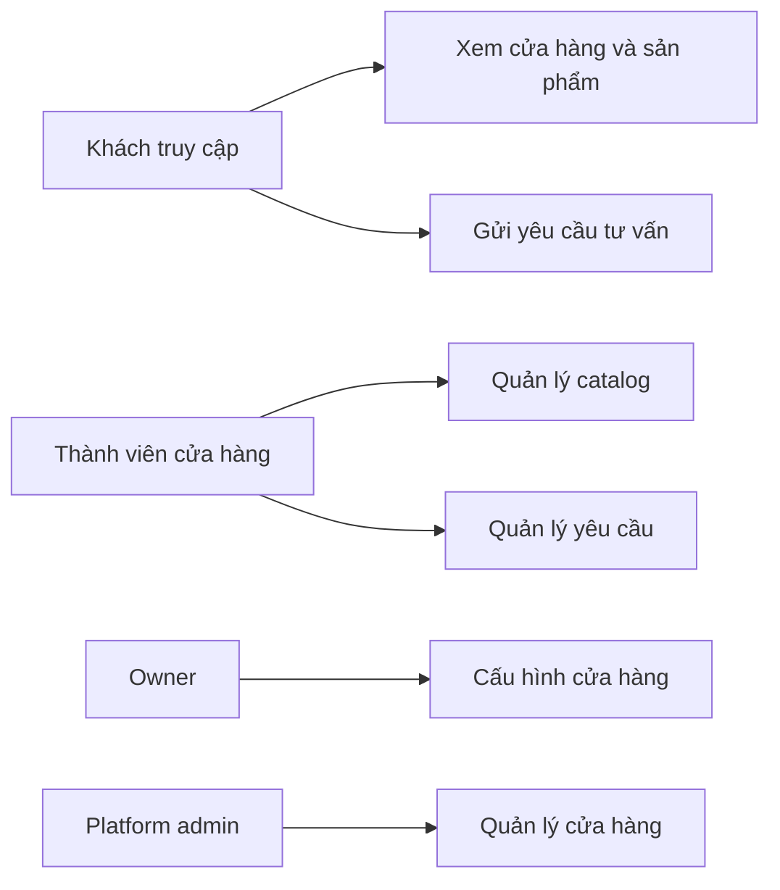

# 02 — Use Cases

## UC-01 — Platform admin tạo cửa hàng

**Actor:** Platform admin  
**Tiền điều kiện:** Đã đăng nhập và có quyền hệ thống.  
**Luồng chính:**

1. Nhập tên cửa hàng, slug, thông tin owner.
2. Hệ thống validate slug và email.
3. Tạo store, user nếu cần và membership `OWNER` trong một transaction.
4. Ghi audit log.
5. Trả thông tin cửa hàng vừa tạo.

**Ngoại lệ:** slug trùng; email không hợp lệ; transaction thất bại.

## UC-02 — Chủ cửa hàng cấu hình trang giới thiệu

1. Owner mở Store Settings.
2. Cập nhật logo, banner, mô tả, địa chỉ, số điện thoại, Zalo/Facebook, giờ mở cửa.
3. Hệ thống kiểm tra dữ liệu và quyền.
4. Lưu cấu hình; trang công khai phản ánh thay đổi.

## UC-03 — Editor tạo sản phẩm

1. Editor mở form sản phẩm.
2. Chọn danh mục, nhập thông tin, loại giá và thuộc tính.
3. Upload ảnh lên object storage.
4. Lưu ở trạng thái `DRAFT` hoặc `PUBLISHED` nếu đủ quyền.
5. Hệ thống tạo slug, kiểm tra uniqueness và tenant ownership.
6. Ghi audit log.

## UC-04 — Khách xem sản phẩm từ Facebook

1. Khách bấm link `/cua-hang/{storeSlug}/san-pham/{productSlug}`.
2. Next.js render metadata và nội dung sản phẩm.
3. API chỉ trả dữ liệu cửa hàng/sản phẩm đang hoạt động và đã xuất bản.
4. Khách xem ảnh, mô tả, giá và nút liên hệ.

## UC-05 — Khách gửi yêu cầu tư vấn

1. Khách nhập họ tên, số điện thoại, nội dung.
2. Frontend validate cơ bản.
3. Backend validate, rate limit và xác định store theo route.
4. Tạo `contact_request` trạng thái `NEW`.
5. Trả thông báo thành công không tiết lộ chi tiết nội bộ.

## UC-06 — Owner xử lý yêu cầu

1. Owner mở danh sách yêu cầu của cửa hàng hiện tại.
2. Lọc theo trạng thái/thời gian.
3. Xem chi tiết và đổi trạng thái.
4. Hệ thống ghi actor và thời gian thay đổi.

## UC-07 — Platform admin tạo membership OWNER

1. Platform admin tạo store và user owner hoặc chọn user chưa thuộc store.
2. Hệ thống tạo membership `OWNER` trong cùng transaction.
3. Hệ thống từ chối nếu user đã thuộc một store trong MVP.
4. Mọi request admin sau đó resolve tenant context từ membership duy nhất.

## UC-08 — Chặn truy cập chéo tenant

1. Thành viên store A gửi request tới ID sản phẩm của store B.
2. Repository truy vấn bằng `(id, store_id=A)`.
3. Không tìm thấy dữ liệu; API trả `404` hoặc lỗi quyền theo chính sách, không tiết lộ sự tồn tại của tài nguyên B.
4. Security event được log khi phù hợp.

## UC-09 — Store suspended hiển thị thông báo

1. Khách mở URL store đang `SUSPENDED`.
2. Hệ thống trả trang thông báo của cửa hàng/nền tảng, không trả product/service catalog.
3. Owner không thể tạo hoặc publish nội dung trong store suspended.

## UC-10 — Owner đổi store slug

1. Owner nhập slug mới trong Store Settings.
2. Backend kiểm tra slug hiện tại và alias không trùng toàn hệ thống.
3. Transaction cập nhật slug mới và tạo `store_slug_aliases` cho slug cũ.
4. URL cũ redirect 301 tới URL mới; audit log ghi thay đổi.

## Sơ đồ use-case mức cao

