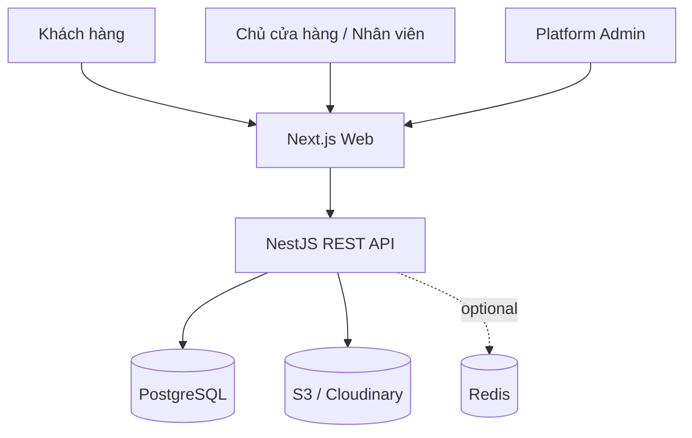
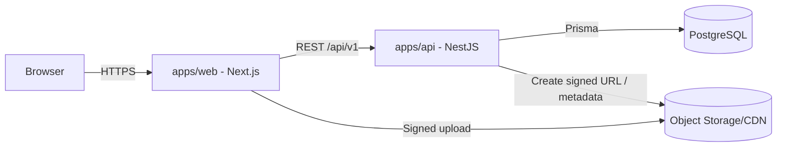
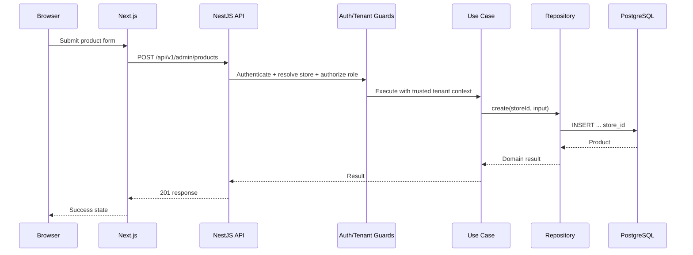
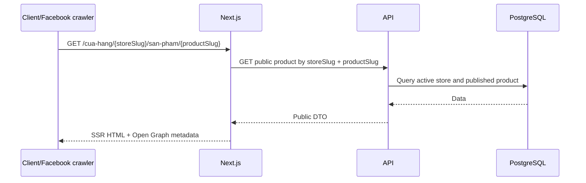

# 03 — System Architecture

## 1. Kiến trúc lựa chọn

- Monorepo.
- Frontend Next.js App Router.
- Backend NestJS modular monolith.
- PostgreSQL + Prisma.
- Object storage cho media.
- REST API có OpenAPI.
- Multi-tenant shared database/shared schema.

## 2. Sơ đồ ngữ cảnh



## 3. Sơ đồ container



## 4. Ranh giới module backend

```text
AuthModule
UsersModule
StoresModule
StoreMembersModule
CategoriesModule
BrandsModule
ProductsModule
ProductAttributesModule
MediaModule
ServicesModule
ContactRequestsModule
StoreSettingsModule
AuditLogsModule
PlatformAdminModule
HealthModule
```

Quy tắc:

- Module sở hữu dữ liệu và nghiệp vụ của nó.
- Giao tiếp qua application service/public contract.
- Tránh circular dependency.
- Không dùng một `CommonService` chứa mọi nghiệp vụ.

## 5. Luồng request quản trị



## 6. Luồng trang công khai



## 7. Cấu trúc monorepo mục tiêu

```text
homehub/
├── apps/
│   ├── web/
│   └── api/
├── packages/
│   ├── api-client/
│   ├── ui/
│   ├── eslint-config/
│   └── typescript-config/
├── docs/
├── infrastructure/
├── .github/workflows/
├── AGENTS.md
├── pnpm-workspace.yaml
└── turbo.json
```

Không tách `shared-types` thành nơi chia sẻ Prisma model trực tiếp. Public API contract nên được sinh/đồng bộ từ OpenAPI để tránh frontend phụ thuộc cấu trúc database.

## 8. Cấu trúc module backend thực dụng

```text
modules/products/
├── presentation/
│   ├── controllers/
│   └── dto/
├── application/
│   ├── use-cases/
│   └── ports/
├── domain/
│   ├── entities/
│   ├── enums/
│   └── errors/
├── infrastructure/
│   ├── repositories/
│   └── mappers/
└── products.module.ts
```

Module đơn giản có thể gộp bớt tầng, nhưng controller không được chứa business logic.

## 9. Frontend structure

```text
apps/web/src/
├── app/
│   ├── (storefront)/cua-hang/[storeSlug]/...
│   ├── (dashboard)/admin/...
│   ├── (platform)/platform/...
│   └── login/
├── features/
│   ├── auth/
│   ├── stores/
│   ├── products/
│   ├── categories/
│   └── contact-requests/
├── components/
├── lib/
└── config/
```

## 10. Nguyên tắc mở rộng

- Scale web/API theo chiều ngang khi cần.
- Ảnh qua CDN/object storage.
- Redis chỉ thêm khi có yêu cầu cache/rate limit/queue thực tế.
- BullMQ có thể thêm cho xử lý ảnh, email, import dữ liệu.
- Search engine chỉ thêm khi PostgreSQL search không đáp ứng.
- Microservice chỉ xem xét khi có ranh giới vận hành rõ, tải độc lập và đội ngũ đủ năng lực.
