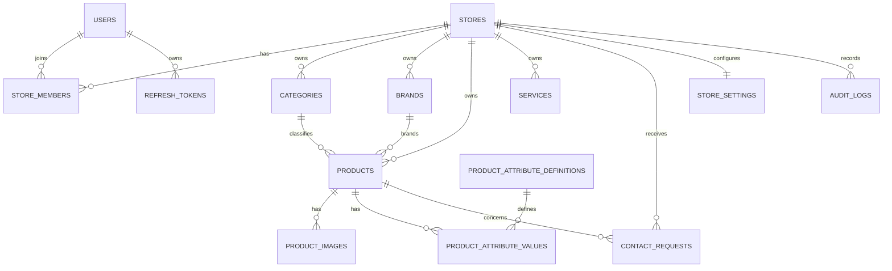

# 04 — Database Design

## 1. Chiến lược multi-tenant

Sử dụng **shared database, shared schema**. Mọi bảng thuộc về cửa hàng phải có `store_id` và index phù hợp.

## 2. ERD mức cao



## 3. Bảng chính

### `users`

- `id` UUID/ULID, primary key.
- `email` unique, normalized.
- `password_hash`.
- `display_name`.
- `status`: ACTIVE, INVITED, LOCKED, DISABLED.
- timestamps.

### `stores`

- `id`.
- `name`.
- `slug` unique toàn hệ thống.
- `status`: ACTIVE, SUSPENDED, ARCHIVED.
- `owner_contact_email` tùy chọn.
- timestamps, `deleted_at` nếu cần archival.

### `store_members`

- `id`, `store_id`, `user_id`.
- `role`: OWNER, MANAGER, EDITOR, VIEWER.
- `status`: ACTIVE, INVITED, DISABLED.
- unique `(store_id, user_id)`.
- index `(user_id, status)` và `(store_id, role)`.

### `categories`

- `id`, `store_id`, `parent_id` nullable.
- `name`, `slug`, `description`, `image_key`.
- `sort_order`, `status`.
- unique `(store_id, slug)`.
- parent phải cùng `store_id`.

### `brands`

- `id`, `store_id`, `name`, `slug`, `logo_key`, `status`.
- unique `(store_id, slug)`.

### `products`

- `id`, `store_id`, `category_id`, `brand_id` nullable.
- `name`, `slug`, `sku` nullable.
- `short_description`, `description`.
- `price_type`: FIXED, CONTACT, FROM, RANGE.
- `price`, `sale_price`, `min_price`, `max_price` nullable.
- `stock_status`: IN_STOCK, OUT_OF_STOCK, PREORDER, UNKNOWN.
- `publication_status`: DRAFT, PUBLISHED, HIDDEN.
- `is_featured`, `published_at`.
- timestamps, `deleted_at`.
- unique `(store_id, slug)`.
- unique `(store_id, sku)` khi SKU không null.

### `services`

- `id`, `store_id`.
- `name`, `slug`, `short_description`, `description`.
- `price_type`, `price`, `min_price`, `max_price` nullable theo cùng quy tắc `products`.
- `publication_status`, `is_featured`, `published_at`.
- `cover_image_key` nullable, timestamps, `deleted_at`.
- unique `(store_id, slug)`.

### `product_images`

- `id`, `store_id`, `product_id`.
- `storage_key`, `public_url` hoặc URL được suy ra.
- `alt_text`, `sort_order`, `is_primary`, `width`, `height`, `mime_type`.
- index `(store_id, product_id, sort_order)`.

### `product_attribute_definitions`

- `id`, `store_id`, `category_id` nullable.
- `name`, `code`, `data_type`: TEXT, NUMBER, BOOLEAN, SELECT.
- `is_filterable`, `sort_order`, `options_json` nullable.
- unique `(store_id, code)`.

### `product_attribute_values`

- `id`, `store_id`, `product_id`, `attribute_definition_id`.
- một trong `value_text`, `value_number`, `value_boolean`, `value_json`.
- unique `(product_id, attribute_definition_id)`.
- definition và product phải cùng store.

### `contact_requests`

- `id`, `store_id`, `product_id` nullable.
- `customer_name`, `customer_phone`, `customer_email` nullable.
- `message`.
- `status`: NEW, CONTACTED, COMPLETED, CANCELLED.
- `source`: WEBSITE, FACEBOOK, ZALO, OTHER.
- `assigned_to_user_id` nullable.
- timestamps.

### `store_settings`

- `store_id` unique.
- logo/banner storage keys.
- description, address, phone, email.
- zalo_url, facebook_url, map_url.
- opening_hours JSONB.
- theme settings JSONB có schema validation ở application layer.
- SEO defaults.

### `refresh_tokens`

- `id`, `user_id`, `token_hash`, `expires_at`, `revoked_at`, device metadata.
- Không lưu token thô.

### `audit_logs`

- `id`, `store_id` nullable cho platform event.
- `actor_user_id`.
- `action`, `entity_type`, `entity_id`.
- `before_json`, `after_json` đã lọc dữ liệu nhạy cảm.
- IP/user-agent tùy chính sách.
- `created_at`.

## 4. Index bắt buộc

```text
products(store_id, publication_status, deleted_at)
products(store_id, category_id, publication_status)
products(store_id, slug)
services(store_id, publication_status, deleted_at)
services(store_id, slug)
categories(store_id, slug)
brands(store_id, slug)
contact_requests(store_id, status, created_at DESC)
store_members(user_id, status)
product_images(store_id, product_id, sort_order)
```

## 5. Quy tắc truy vấn

Không dùng:

```ts
prisma.product.findUnique({ where: { id } });
```

Đối với tenant-owned resource, dùng điều kiện tenant:

```ts
prisma.product.findFirst({
  where: { id, storeId, deletedAt: null },
});
```

Hoặc thiết kế compound key phù hợp.

## 6. Transaction

Dùng transaction cho:

- Tạo store + owner membership.
- Tạo product + attributes + image metadata nếu cần atomicity.
- Chuyển owner/xóa membership nhạy cảm.
- Xóa mềm sản phẩm và cập nhật liên quan.

## 7. Migration và seed

- Mỗi thay đổi schema có migration riêng, tên mô tả rõ.
- Không chỉnh sửa migration đã được áp dụng ở môi trường chia sẻ.
- Seed chỉ tạo dữ liệu demo không chứa secret.
- Có ít nhất hai store demo để chạy test cross-tenant.
