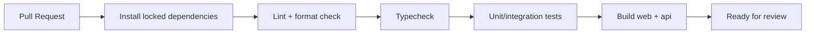

# 09 — DevOps and Operations

## 1. Môi trường

- `local`: phát triển cá nhân.
- `test`: integration/E2E.
- `staging`: gần production, dùng demo/nghiệm thu.
- `production`: dữ liệu thật.

Không dùng chung database giữa staging và production.

## 2. Environment variables

Ví dụ nhóm biến:

```text
DATABASE_URL
APP_BASE_URL
WEB_BASE_URL
ACCESS_TOKEN_SECRET
REFRESH_TOKEN_SECRET
OBJECT_STORAGE_ENDPOINT
OBJECT_STORAGE_BUCKET
OBJECT_STORAGE_ACCESS_KEY
OBJECT_STORAGE_SECRET_KEY
CORS_ALLOWED_ORIGINS
LOG_LEVEL
```

Validate environment khi ứng dụng khởi động.

## 3. Docker local

Docker Compose nên cung cấp:

- PostgreSQL.
- MinIO tùy chọn cho object storage local.
- Redis chỉ khi module thực sự sử dụng.

Web/API có thể chạy local ngoài container để hot reload nhanh.

## 4. CI pipeline



## 5. CD

- Deploy staging sau merge main.
- Production cần manual approval trong giai đoạn đầu.
- Chạy migration theo chiến lược backward-compatible.
- Có health check trước khi chuyển traffic.

## 6. Observability

Tối thiểu:

- Structured JSON logs ở API.
- `requestId` xuyên request.
- Health endpoints: liveness và readiness.
- Theo dõi HTTP error rate, latency, database connection và storage error.
- Error tracking cho web/API nếu có ngân sách.

## 7. Backup và restore

- Backup PostgreSQL định kỳ.
- Object storage bật versioning/lifecycle nếu dịch vụ hỗ trợ.
- Có tài liệu restore và kiểm thử restore định kỳ.
- Không coi backup là hợp lệ nếu chưa thử phục hồi.

## 8. Migration production

- Không chạy destructive migration trực tiếp nếu chưa có plan.
- Thêm cột nullable/default trước, backfill, sau đó mới enforce constraint.
- Backup trước migration rủi ro.
- Ghi migration version trong release notes.

## 9. Release checklist

- CI xanh.
- Migration đã review.
- Không có secret trong diff.
- Cross-tenant tests xanh.
- OpenAPI và docs cập nhật.
- Smoke test: login, create/view product, contact form.
- Rollback plan rõ ràng.
